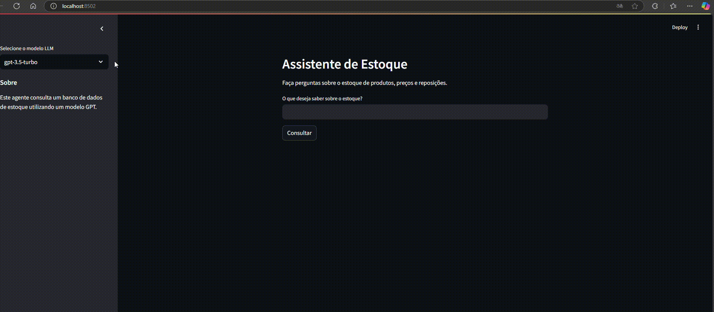

# agente_estoque
 Projeto do curso IA MASTER

# Agente de Consulta de Estoque

Este projeto é uma aplicação Python que usa o Streamlit, OpenAI e Poetry para criar um agente que conecta-se a um banco de dados de estoque e retorna informações específicas sobre o inventário. Ele foi projetado para facilitar o acesso às informações do estoque de forma rápida e intuitiva, com perguntas em linguagem natural.

## Tecnologias Utilizadas

- **Python**: Linguagem principal do projeto.
- **Streamlit**: Framework para criação de aplicações web interativas.
- **OpenAI API**: Motor de linguagem natural que interpreta as perguntas e consulta o banco de dados.
- **Langchain**: Para criar o agente de ia
- **Poetry**: Gerenciador de dependências e ambiente virtual.

## Pré-requisitos

Certifique-se de ter os seguintes pré-requisitos instalados em seu ambiente:

- Python 3.7+
- Conta e chave de API na [OpenAI](https://platform.openai.com/)
- Banco de dados de estoque configurado e com acesso habilitado
- [Poetry](https://python-poetry.org/) para gerenciar dependências

## Configuração

1. **Clone o repositório:**

   ```bash
   git clone https://github.com/seu-usuario/nome-do-repositorio.git
   cd nome-do-repositorio
   ```

2. **Configure o ambiente com o Poetry:**

   ```bash
   poetry install
   ```

3. **Configure as variáveis de ambiente** para acessar o banco de dados e a chave da API OpenAI. Crie um arquivo `.env` na raiz do projeto e adicione as variáveis necessárias:

   ```
   OPENAI_API_KEY='sua-chave-api'
   ```

4. **Execute o Streamlit**:

   ```bash
    task run
   ```

   ou 

    ```bash
    streamlit run app.py
    ```
   O aplicativo estará disponível em `http://localhost:8501`.

## Uso

1. Acesse a interface do Streamlit no seu navegador.
2. Selecione o modelo 
3. Insira a pergunta sobre o estoque, como:
   -  "Qual o número de itens no estoque?" ou "Quantas unidades do produto X temos?".
4. O agente interpretará a pergunta e retornará a resposta a partir do banco de dados de estoque.

## Estrutura do Projeto

- `app.py`: Script principal que executa a aplicação Streamlit.
- `agent.py`: Código do agente que conecta-se à API OpenAI e ao banco de dados.
- `database.py`: Módulo responsável por estabelecer a conexão e realizar consultas no banco de dados.
- `README.md`: Este arquivo com as instruções do projeto.




## Dependências

As dependências estão listadas no arquivo `pyproject.toml`, e incluem:

- `streamlit`
- `langchain-openai`
- `langchain-community`
- `langchain-experimental`
- `python-dotenv`


## Contribuição

Contribuições são bem-vindas! Sinta-se à vontade para abrir issues ou enviar pull requests.

## Licença

Este projeto está sob a licença MIT. Consulte o arquivo `LICENSE` para mais informações.
